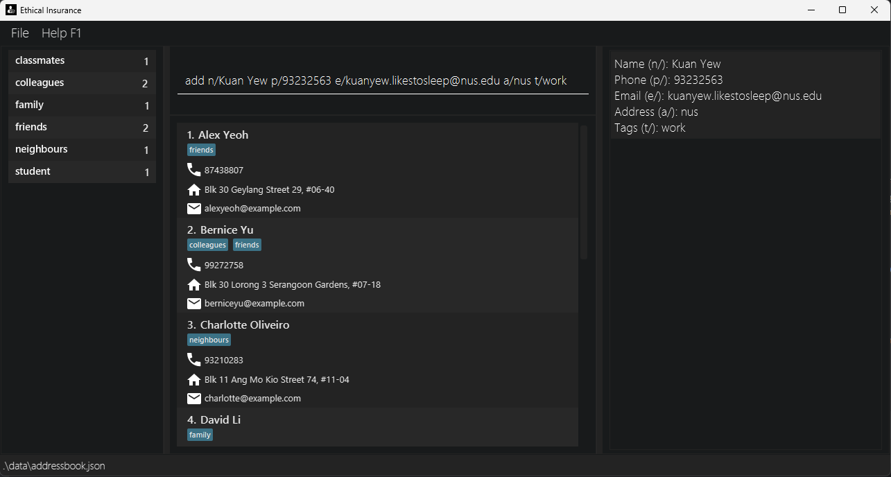
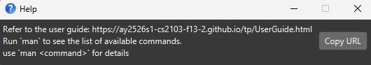

AddressBook Level 3 (AB3) is a **desktop app for managing contacts, optimized for use via a Command Line Interface** (CLI) while still having the benefits of a Graphical User Interface (GUI). If you can type fast, AB3 can get your contact management tasks done faster than traditional GUI apps.

* Table of Contents
{:toc}

--------------------------------------------------------------------------------------------------------------------

## Quick start

1. Ensure you have Java `17` or above installed in your Computer. 
   **Mac users:** Ensure you have the precise JDK version prescribed [here](https://se-education.org/guides/tutorials/javaInstallationMac.html).

1. Download the latest `.jar` file from [here](https://github.com/se-edu/addressbook-level3/releases).

1. Copy the file to the folder you want to use as the _home folder_ for your AddressBook.

1. Open a command terminal, `cd` into the folder you put the jar file in, and use the `java -jar addressbook.jar` command to run the application. 
   A GUI similar to the below should appear in a few seconds. Note how the app contains some sample data. 
   

1. Type the command in the command box and press Enter to execute it. e.g. typing **`help`** and pressing Enter will open the help window. 
   Some example commands you can try:

   * `list` : Lists all contacts.

   * `add n/John Doe p/98765432 e/johnd@example.com a/John street, block 123, #01-01` : Adds a contact named `John Doe` to the Address Book.

   * `delete 3` : Deletes the 3rd contact shown in the current list.

   * `clear` : Deletes all contacts.

   * `exit` : Exits the app.

1. Refer to the [Features](#features) below for details of each command.

--------------------------------------------------------------------------------------------------------------------

## Features

**:information_source: Notes about the command format:** 

* Words in `UPPER_CASE` are the parameters to be supplied by the user. 
  e.g. in `add n/NAME`, `NAME` is a parameter which can be used as `add n/John Doe`.

* Items in square brackets are optional. 
  e.g `n/NAME [t/TAG]` can be used as `n/John Doe t/friend` or as `n/John Doe`.

* Items with `…`​ after them can be used multiple times including zero times. 
  e.g. `[t/TAG]…​` can be used as ` ` (i.e. 0 times), `t/friend`, `t/friend t/family` etc.

* Parameters can be in any order. 
  e.g. if the command specifies `n/NAME p/PHONE_NUMBER`, `p/PHONE_NUMBER n/NAME` is also acceptable.

* Extraneous parameters for commands that do not take in parameters (such as `help`, `list`, `exit` and `clear`) will be ignored. 
  e.g. if the command specifies `help 123`, it will be interpreted as `help`.

* If you are using a PDF version of this document, be careful when copying and pasting commands that span multiple lines as space characters surrounding line-breaks may be omitted when copied over to the application.

### Viewing help : `help`

Shows a message explaining how to access the help page.

Format: `help`

### Adding a person: `add`

Adds a person to the address book.

Format: `add n/NAME p/PHONE_NUMBER e/EMAIL a/ADDRESS [t/TAG]…​`

:bulb: **Tip:**
A person can have any number of tags (including 0)

Examples:
* `add n/John Doe p/98765432 e/johnd@example.com a/John street, block 123, #01-01`
* `add n/Betsy Crowe t/friend e/betsycrowe@example.com a/Newgate Prison p/1234567 t/criminal`

### Use case: `add`

Example 1  
System: Insurance Management App 
Actor: Insurance Agent 

MSS:

1. Agent issues add n/NAME p/PHONE e/EMAIL a/ADDRESS [t/TAG]... command.

2. System validates each parameter.

3. System checks for duplicates using (name + phone).

4. If valid, system creates a new client entry and updates the display.

- Use case ends.

Extensions:

- 2a. Missing required fields.  
- 2a1. System displays: “ERROR: Missing required fields. Required: n/, p/, e/, a/.”
- Use case ends. 
 
- 2b. Invalid parameter format.
- 2b1. System displays specific error message (e.g., “Phone must be a valid number”).
- 2b2. Agent corrects input.
- Use case resumes from step 2. 
 
- 3a. Duplicate detected.
- 3a1. System displays: “DUPLICATE CLIENT: A client with the same phone/email already exists.”
- 3a2. Agent may use edit INDEX instead.
- Use case ends.

### Listing all persons : `list`

Shows a list of all persons in the address book.

Format: `list`

### Use case: list 

Example 1  
System: Insurance Management App 
Actor: Insurance Agent 

MSS:

1. Agent issue list command

2. System display all the persons in the address book

3. Use case ends

### Editing a person : `edit`

Edits an existing person in the address book.

Format: `edit INDEX [n/NAME] [p/PHONE] [e/EMAIL] [a/ADDRESS] [t/TAG]…​`

* Edits the person at the specified `INDEX`. The index refers to the index number shown in the displayed person list. The index **must be a positive integer** 1, 2, 3, …​
* At least one of the optional fields must be provided.
* Existing values will be updated to the input values.
* When editing tags, the existing tags of the person will be removed i.e adding of tags is not cumulative.
* You can remove all the person’s tags by typing `t/` without
    specifying any tags after it.

Examples:
*  `edit 1 p/91234567 e/johndoe@example.com` Edits the phone number and email address of the 1st person to be `91234567` and `johndoe@example.com` respectively.
*  `edit 2 n/Betsy Crower t/` Edits the name of the 2nd person to be `Betsy Crower` and clears all existing tags.

### Use case: `edit`

> **System:** Insurance Management App  
> **Actor:** Insurance Agent  
>
> **MSS:**  
> 1. Agent issues edit INDEX [n/NAME] [p/PHONE] [e/EMAIL] [a/ADDRESS] [t/TAG]... command.  
> 2. System validates the index and input fields.  
> 3. System checks for duplicates (name + phone).  
> 4. If valid, system updates client details and displays confirmation.  
>    - Use case ends.  
>
> **Extensions:**  
> - 2a. Index out of bounds.  
>   - 2a1. System displays error: “Index not found.”  
>   - Use case ends.  
>
> - 2b. Invalid parameter format.  
>   - 2b1. System displays error specifying invalid field.  
>   - 2b2. Agent corrects input.  
>   - Use case resumes from step 2.  
>
> - 3a. Duplicate detected.  
>   - 3a1. System displays duplicate warning.  
>   - Use case ends.  
>
> - 4a. Tag replacement error.  
>   - 4a1. System rejects entire edit if one invalid tag is found.  
>   - Use case ends.  
>
> - 4b. Storage failure occurs.  
>   - 4b1. System displays: “Couldn’t save data. Your edit was cancelled.”  
>   - Use case ends.  

### Locating persons by name: `find`

Finds persons whose names contain any of the given keywords.

Format: `find KEYWORD [MORE_KEYWORDS]`

* The search is case-insensitive. e.g `hans` will match `Hans`
* The order of the keywords does not matter. e.g. `Hans Bo` will match `Bo Hans`
* Only the name is searched.
* Only full words will be matched e.g. `Han` will not match `Hans`
* Persons matching at least one keyword will be returned (i.e. `OR` search).
  e.g. `Hans Bo` will return `Hans Gruber`, `Bo Yang`

Examples:
* `find John` returns `john` and `John Doe`
* `find alex david` returns `Alex Yeoh`, `David Li` 
  

### Use case: `find`

> **System:** Insurance Management App  
> **Actor:** Insurance Agent  
>
> **MSS:**  
> 1. Agent issues find STRING command.  
> 2. System searches client records by name, UID, email, or phone.  
> 3. System returns matching records in a tabular list (CLI) or as clickable results (GUI).  
> 4. Agent views or selects the desired client record.  
>    - Use case ends.  
>
> **Extensions:**  
> - 2a. No matches found.  
>   - 2a1. System displays: “No clients matched the provided filters.”  
>   - Use case ends.  
>
> - 2b. Invalid parameter provided (e.g., malformed input).  
>   - 2b1. System displays error specifying the issue (e.g., invalid characters).  
>   - 2b2. Agent re-enters correct input.  
>   - Use case resumes from step 2.  
>
> - 2c. Conflicting filters applied.  
>   - 2c1. System displays: "No clients matched all provided filters."  
>   - Use case ends.  

### Deleting a person : `delete`

Deletes the specified person from the address book.

Format: `delete INDEX`

* Deletes the person at the specified `INDEX`.
* The index refers to the index number shown in the displayed person list.
* The index **must be a positive integer** 1, 2, 3, …​

Examples:
* `list` followed by `delete 2` deletes the 2nd person in the address book.
* `find Betsy` followed by `delete 1` deletes the 1st person in the results of the `find` command.

### Use case: `delete`

> **System:** Insurance Management App  
> **Actor:** Insurance Agent  
>
> **MSS:**  
> 1. Agent issues delete INDEX command.  
> 2. System verifies the index.  
> 3. System deletes the client record at that index.  
> 4. System displays confirmation: “Deleted Person: <Client details>”.  
>    - Use case ends.  
>
> **Extensions:**  
> - 2a. Index out of bounds.  
>   - 2a1. System displays error: “Index not found.”  
>   - Use case ends.  

### Clearing all entries : `clear`

Clears all entries from the address book.

Format: `clear`

### Exiting the program : `exit`

Exits the program.

Format: `exit`

### Command guide : `help`

Display the command guide.

Format: `help`

### Use case: `help`

> **System:** Insurance Management App  
> **Actor:** Insurance Agent  
>
> **MSS:**  
> 1. Agent issues help command.  
> 2. System displays a list of commands with usage details.  
> 3. Agent reads and continues working.  
>    - Use case ends.  
>
> **Extensions:**  
> - 1a. Agent types synonym (e.g., guide, man).  
>   - 1a1. System displays: “Unknown command. Type help to see available commands.”  
>   - Use case ends.  

### Command guide : `stats`

Display the summary statistics.

Format: `stats`

### Use case: `stats`

> **System:** Insurance Management App  
> **Actor:** Insurance Agent  
>
> **MSS:**  
> 1. Agent issues stats command.  
> 2. System analyses customer data.  
> 3. System displays summary table (Packages vs. No. of Customers).  
> 4. Agent reviews performance insights.  
>    - Use case ends.  
>
> **Extensions:**  
> - 2a. No data available.  
>   - 2a1. System displays: “No statistics available – no clients found.”  
>   - Use case ends.  

### Saving the data

AddressBook data are saved in the hard disk automatically after any command that changes the data. There is no need to save manually.

### Editing the data file

AddressBook data are saved automatically as a JSON file `[JAR file location]/data/addressbook.json`. Advanced users are welcome to update data directly by editing that data file.

:exclamation: **Caution:**
If your changes to the data file makes its format invalid, AddressBook will discard all data and start with an empty data file at the next run. Hence, it is recommended to take a backup of the file before editing it. 
Furthermore, certain edits can cause the AddressBook to behave in unexpected ways (e.g., if a value entered is outside of the acceptable range). Therefore, edit the data file only if you are confident that you can update it correctly.

### Archiving data files `[coming in v2.0]`

_Details coming soon ..._

--------------------------------------------------------------------------------------------------------------------

## FAQ

**Q**: How do I transfer my data to another Computer? 
**A**: Install the app in the other computer and overwrite the empty data file it creates with the file that contains the data of your previous AddressBook home folder.

--------------------------------------------------------------------------------------------------------------------

## Known issues

1. **When using multiple screens**, if you move the application to a secondary screen, and later switch to using only the primary screen, the GUI will open off-screen. The remedy is to delete the `preferences.json` file created by the application before running the application again.
2. **If you minimize the Help Window** and then run the `help` command (or use the `Help` menu, or the keyboard shortcut `F1`) again, the original Help Window will remain minimized, and no new Help Window will appear. The remedy is to manually restore the minimized Help Window.

--------------------------------------------------------------------------------------------------------------------

## Command summary

Action | Format, Examples
--------|------------------
**Add** | `add n/NAME p/PHONE_NUMBER e/EMAIL a/ADDRESS [t/TAG]…​`   e.g., `add n/James Ho p/22224444 e/jamesho@example.com a/123, Clementi Rd, 1234665 t/friend t/colleague`
**Clear** | `clear`
**Delete** | `delete INDEX`  e.g., `delete 3`
**Edit** | `edit INDEX [n/NAME] [p/PHONE_NUMBER] [e/EMAIL] [a/ADDRESS] [t/TAG]…​`  e.g.,`edit 2 n/James Lee e/jameslee@example.com`
**Find** | `find KEYWORD [MORE_KEYWORDS]`  e.g., `find James Jake`
**List** | `list`
**Help** | `help`
